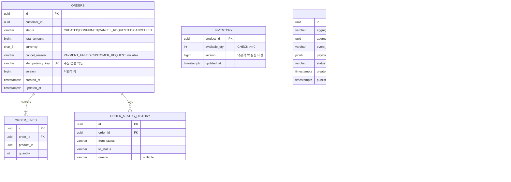
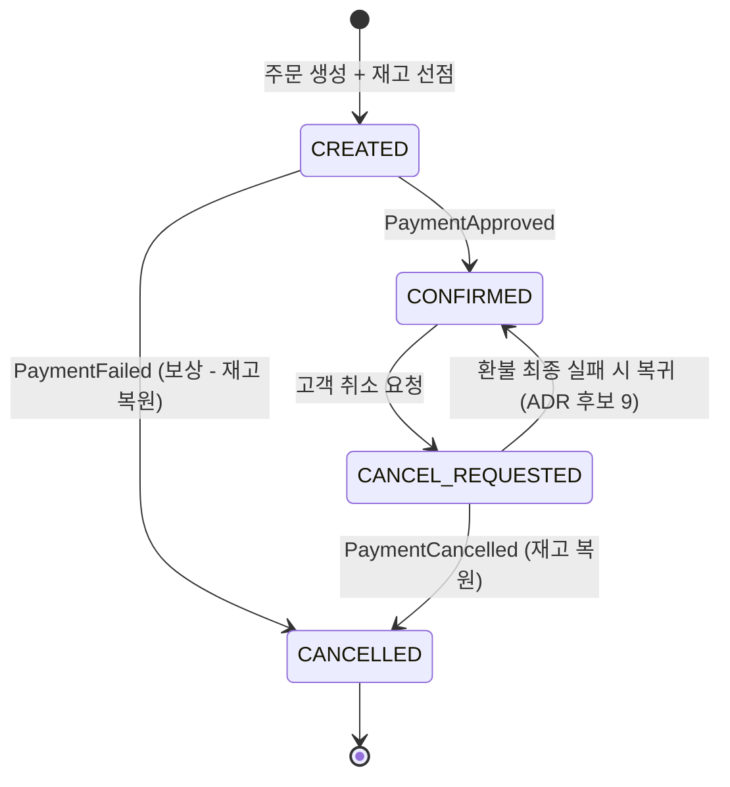
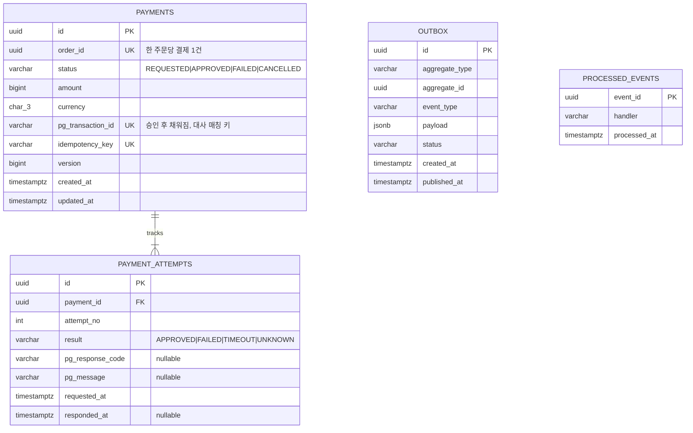
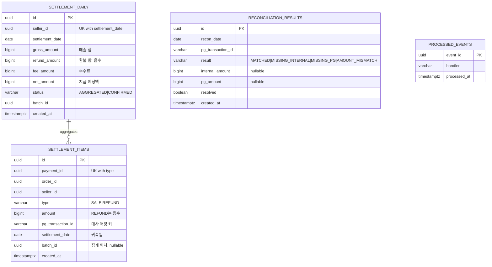

# ERD v0.1 — 주문 · 결제 · 정산

> Phase 0 산출물. 이벤트 설계 v0.1과 주문 상태 머신을 기반으로 한다.
> 상태: Draft — Phase 1 구현 중 갱신.

## 0. 공통 설계 원칙

- **서비스별 DB 완전 분리.** 교차 서비스 FK 없음 — 다른 서비스의 ID는 단순 값으로만 저장한다. (정합성은 이벤트로 맞춘다)
- PK는 UUID(v7 권장 — 시간 정렬 가능), 금액은 `BIGINT` 원 단위, 통화는 `CHAR(3)`.
- 상태를 가진 애그리거트 루트에는 `version` 컬럼(낙관적 락) — 상태 전이 경합 방지.
- **Outbox / Inbo[event-design-v0.1.md](event-design-v0.1.md)x 패턴 공통 테이블**: 발행 측은 `outbox`, 구독 측은 `processed_events`(멱등 처리 이력)를 각 서비스 DB에 동일 구조로 둔다.
- 모든 테이블에 `created_at`, 변경되는 테이블에 `updated_at`.

---

## 1. 주문 서비스 (order_db)

### 설계 노트

- `idempotency_key UNIQUE`가 주문 생성 멱등의 핵심. 중복 요청 시 INSERT 충돌 → 기존 주문 반환.
- `inventory.version`은 ADR #8(재고 동시성 제어) 실험용. 비관적 락(`SELECT ... FOR UPDATE`) / 낙관적 락(version) / Redis 원자 연산 세 가지를 같은 테이블 위에서 구현 비교한다.
- `order_status_history`는 감사 추적용. "이 주문이 왜 취소됐고 어떤 이벤트가 전이를 일으켰나"를 역추적 가능하게 한다.
- `processed_events`의 PK는 `(event_id, handler)` 복합 — 한 이벤트를 여러 핸들러가 각각 멱등 처리.

### 주문 상태 머신

- 허용된 전이 외의 이벤트 수신은 거부하되 로그·메트릭으로 기록한다.
- 같은 이벤트 재수신 시 이미 목표 상태면 조용히 무시(멱등), 모순 이벤트는 거부 후 기록.
- 상태 전이는 `version` 기반 낙관적 락으로 경합을 차단하고, 모든 전이는 `order_status_history`에 남는다.

---

## 2. 결제 서비스 (payment_db)

### 설계 노트

- `payment_attempts`가 타임아웃 시나리오(이벤트 설계 2.3)의 기록 장치. `result = TIMEOUT/UNKNOWN`인 시도가 남고, 상태 조회 후 최종 판정이 새 attempt로 쌓인다. 재시도 정책을 설명할 때 이 테이블을 보여주면 된다.
- `pg_transaction_id`는 정산 대사의 매칭 키이므로 UNIQUE. 환불 시 PG가 별도 거래 ID를 주는 경우(실무 일반적)를 모의 PG에도 반영할지는 Phase 3에서 결정.
- 결제 상태 머신: `REQUESTED → APPROVED | FAILED`, `APPROVED → CANCELLED(환불)`. 주문 것보다 단순하므로 별도 이력 테이블 없이 attempts로 갈음.

---

## 3. 정산 서비스 (settlement_db)

### 설계 노트

- **환불은 UPDATE가 아니라 음수 레코드 INSERT** (`type = REFUND`, amount 음수). 정산 데이터는 회계 장부처럼 불변(append-only)으로 다룬다 — 수정 대신 상쇄. 감사 추적과 대사가 쉬워진다.
- `UNIQUE(payment_id, type)` — PaymentApproved/PaymentCancelled 이벤트 중복 수신 시 정산 레코드가 두 번 생기지 않게 하는 DB 레벨 멱등 장치.
- `settlement_daily`는 일배치(Spring Batch)가 items를 셀러·일자별로 집계해 생성. `UNIQUE(seller_id, settlement_date)`로 배치 재실행 멱등 보장.
- `reconciliation_results`는 모의 PG가 내려주는 거래내역 파일과 items를 대조한 결과. `AMOUNT_MISMATCH`를 일부러 만들어내는 시나리오(모의 PG에 오차 주입 모드)가 Phase 5 실험 재료.
- 수수료는 v0.1에서는 집계 시점에 셀러별 고정 수수료율로 계산. 건별 수수료가 필요해지면 items에 fee 컬럼 추가. *(ADR 후보 #11)*

---

## 4. 추가된 ADR 후보

| # | 질문 | 메모 |
|---|---|---|
| 9 | 환불 최종 실패 시 상태 정책 | CONFIRMED 복귀 + 알림 vs 수동 개입 대기 |
| 10 | 상태 이력: 별도 테이블 vs 이벤트가 곧 이력 | v0.1은 테이블, 이벤트 소싱은 비채택 사유 기록 |
| 11 | 수수료 계산 시점: 집계 시 vs 건별 | v0.1은 집계 시 고정율 |

---

*변경 이력: v0.1 — 초기 ERD (Phase 0)*
